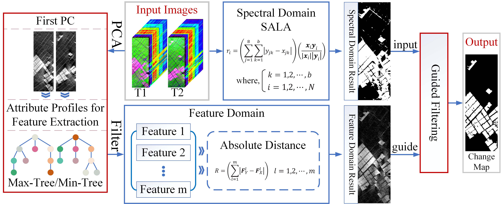
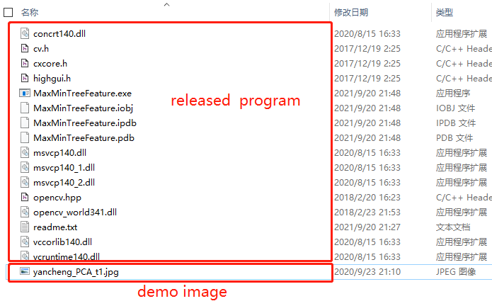
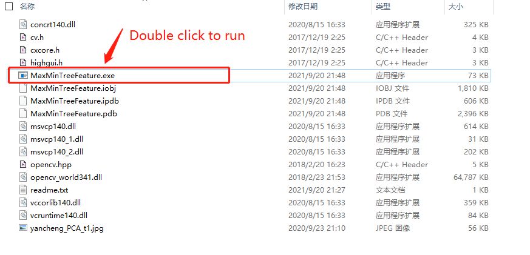
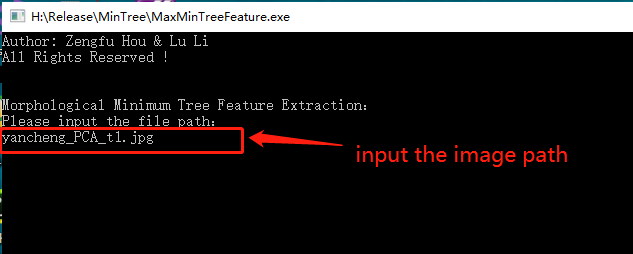

# Hyperspectral-Change-Detection-Based-on-Multiple-Morphological-Profiles


Fig.1. Framework of proposed dual-pipeline hyperspectral change detection framework using multiple morphological profiles


# Prerequisites
**MATLAB R2018a**<br />
**C++ Language (Visual Studio 2017 and OpenCV 3.4.1)**

# Source
**Paper Download:**
- [https://ieeexplore.ieee.org/document/9469924](https://ieeexplore.ieee.org/document/9469924)

**Hermiston dataset:**
- [Google Drive](https://drive.google.com/file/d/1KStxIEiZChTRawhcgrGF3yrSiRj8bRg2/view?usp=sharing)
- [Baidu Disk, Extraction code: ox7g](https://pan.baidu.com/s/1FucIQRCd16nuOUcffcHbhw)

**Statement:**
- The morphological feature extraction in max-tree/min-tree was conducted in VISUAL STUDIO 2017 using C++ language, which provied by prof. Lu Li. Due to copyright, this part of the codes cannot be shared. **However, in order to reproduce the experimental results, we have encapsulated it into an EXE program, and now it has been released.** <br />
- [C++ Matree/Mintree codes](https://github.com/zephyrhours/Max-Tree-and-Min-Tree-Morphological-Feature-Extraction) <br />

**Instructions:**





**Installation and Configuration Instructions:** <br />
- [English Blog: A Detailed Installation and Configuration Processing of OpenCV 3.4.1 and Visual Studio 2017](https://zephyrhours.github.io/post1.html)
- [Chinese CSDN: OpenCV3.4.1和VS2017配置过程详解](https://blog.csdn.net/NBDwo/article/details/107400010)

# Citation
If these codes and dataset are helpful for you, please cite this paper:


**BibTex Format:**<br />
```
@ARTICLE{9469924,
author={Hou, Zengfu and Li, Wei and Li, Lu and Tao, Ran and Du, Qian},
journal={IEEE Transactions on Geoscience and Remote Sensing},
title={Hyperspectral Change Detection Based on Multiple Morphological Profiles},
year={2021},
volume={},
number={},
pages={1-12},
doi={10.1109/TGRS.2021.3090802}}
```

**Plain Text Format:**<br />
```
Z. Hou, W. Li, L. Li, R. Tao and Q. Du, "Hyperspectral Change Detection Based on Multiple Morphological Profiles," in IEEE Transactions on Geoscience and Remote Sensing, doi: 10.1109/TGRS.2021.3090802.
```


# Other Related Papers

[1] **Zengfu Hou**, Wei Li, Ran Tao, and Qian Du. [Three-Order Tucker Decomposition and Reconstruction Detector for Unsupervised Hyperspectral Change Detection](https://ieeexplore.ieee.org/document/9451632) [J]. IEEE Journal of Selected Topics in Applied Earth Observations and Remote Sensing, 2021, doi: 10.1109/JSTARS.2021.3088438]

[2] **Zengfu Hou**, Wei Li, and Qian Du. [A PATCH TENSOR-BASED CHANGE DETECTION FOR HYPERSPECTRAL IMAGES](https://drive.google.com/file/d/1M9cKwbDn8mbvd7VIx1CmWNKYnGnDm4pO/view?usp=sharing)[C]. International Geoscience and Remote Sensing Symposium, 2021, inprint.

# My Website
- [Github Website](https://zephyrhours.github.io/)
- [Chinese CSDN](https://blog.csdn.net/NBDwo)
